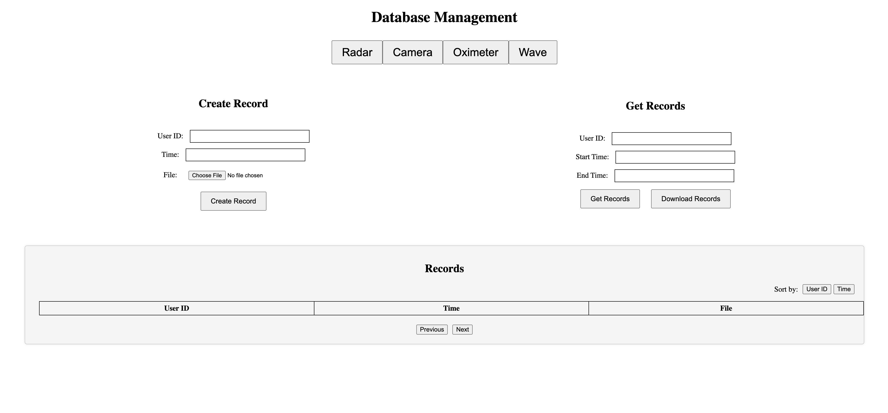

# MediSysDB



MediSysDB is a web-based medical database management system powered by MongoDB. This platform seamlessly integrates a user-friendly web interface for efficient data management and an intuitive API for streamlined maintenance processes. 

MediSysDB empowers medical professionals with seamless data organization, retrieval, and manipulation, ensuring smooth operations and enhanced productivity in the medical domain.


## Table of Contents

- [Overview](#overview)
- [Getting Started](#getting-started)
  - [Prerequisites](#prerequisites)
  - [Installation](#installation)
  - [Configuration](#configuration)
- [Usage](#usage)
- [API Documentation](#api-documentation)
- [Database Schema](#database-schema)
- [Contributing](#contributing)
- [License](#license)
- [Contact](#contact)

## Overview

The MediSysDB project is a versatile database management system specifically tailored to easily manage data records from a diverse range of sensors, including radar, camera, oximeter, and more. Its core purpose is to facilitate efficient data storage, retrieval, and management, making it a helpful tool for applications dealing with sensor-generated data.

This user-friendly system offers an intuitive interface to interact with the underlying database, empowering users to seamlessly query, insert, delete, and update data with ease. By supporting multiple database types, MediSysDB ensures adaptability to different data sources and applications, thereby enhancing data organization and accessibility for both developers and end-users.

With a comprehensive set of features dedicated to handling sensor data, the MediSysDB project fosters streamlined data management processes, ultimately contributing to improved productivity and performance in various applcations reliant on sensor data.

## Getting Started

### Prerequisites

Before using the MediSysDB database management system, users must ensure that their system meets the following prerequisites and has Docker installed:

1. **Operating System Compatibility**: MediSysDB is compatible with various operating systems, including Windows, macOS, and Linux. Users should ensure that their system is running one of these supported operating systems.


2. **Docker Installation**: Docker is a prerequisite for running the MediSysDB system. Docker allows users to create and manage containers for their applications. To install Docker, please follow the instructions for your specific operating system:

   - For Windows: [Docker Desktop for Windows](https://docs.docker.com/desktop/windows/install/)
   - For macOS: [Docker Desktop for Mac](https://docs.docker.com/desktop/mac/install/)
   - For Linux: [Docker Engine Installation](https://docs.docker.com/engine/install/)

   
3. **Hardware Requirements**: While Docker is a lightweight virtualization solution, users should ensure that their system meets the hardware requirements to run Docker smoothly. Generally, a computer with a multi-core processor, ample RAM, and available disk space should suffice.


4. **Internet Connection**: An active internet connection is required during the installation of Docker and when running the MediSysDB system. Docker images and dependencies will be downloaded from online repositories, and internet access is necessary for updates and any external data retrieval.

Once users have fulfilled these prerequisites and successfully installed Docker on their system, they will be ready to deploy and utilize the MediSysDB database management system efficiently.


### Installation

To install and set up the MediSysDB database management system, follow these step-by-step instructions:

1. **Download the Project**:
   - Clone or download the project repository from the GitHub repository to your local machine.

2. **Navigate to Project Folder**:
   - Open a terminal or command prompt and navigate to the root folder of the downloaded project.

3. **Build and Start the Docker Containers**:
   - In the terminal, execute the following command to build and start the Docker containers:
     ```
     docker-compose up --build
     ```
   - This command will download the required Docker images, build the containers, and start the services for MediSysDB.

4. **Access the Web Management System**:
   - Once the Docker services are up and running, you can access the web-based management system by opening a web browser and navigating to http://localhost:8080.
   - The MediSysDB user interface will be displayed, allowing you to manage data records from various types of sensors.

### Configuration

The MediSysDB database management system provides some configuration options and environment variables that you can customize according to your specific requirements:

1. **Database Settings**:
   - The system supports multiple database types. You can modify the `docker-compose.yml` file to use a different database image based on your preference (e.g., MongoDB, PostgreSQL, etc.).


2. **Environment Variables**:
   - In the `docker-compose.yml` file, you can set environment variables to customize the behavior of the system, such as database credentials, port numbers, or any other required configurations.


### Usage

- After the initial build and setup, you can start and stop the Docker services using the following commands:
  ```
  docker-compose start   # To start the MediSysDB services
  docker-compose stop    # To stop the MediSysDB services
  ```
- You can also check the status and information of the running Docker containers using the `docker ps` command.

By following these installation and configuration instructions, you can quickly deploy and utilize the MediSysDB database management system to efficiently manage data records from various types of sensors, including radar, camera, oximeter, and more.

**Note**: For examples of how to make API calls to the MediSysDB database management system, you can refer to the `api_calls.py` file included in the project. This file provides sample code snippets that demonstrate how to interact with the system's endpoints and perform CRUD operations on data records from different types of sensors, such as radar, camera, oximeter, and more. It serves as a helpful resource to understand the API functionalities and integrate the database management system seamlessly into your applications. Happy coding!


## API Documentation

**API: Create Record**
- **Endpoint**: `/<string:sensorID>/create/`
- **Method**: POST
- **Parameters**:
  - `sensorID` (string): ID of the sensor for which the record will be created
  - `user_id` (integer): User ID associated with the record
  - `time` (string, optional): Time associated with the record in the format "YYYY-MM-DD HH:MM:SS" (if not provided, the current time will be used)
  - `file` (file): File to be uploaded and associated with the record

- **Response**:
  ```
  {
    "status": "Document inserted."
  }
  ```

- **Description**: This API endpoint allows you to create a new record in the database for a specific sensor. You need to provide the `sensorID`, `user_id`, and `file` in the request parameters. The `time` parameter is optional and can be provided to specify the time associated with the record, otherwise, the current time will be used.

  Upon successful insertion of the document, the API will return a JSON response with the status message "Document inserted."

  If any of the provided parameters are missing or invalid, the API will respond with an appropriate error message and status code.

  Additionally, the API will check if a record with the same `user_id` and `time` already exists in the database. If a matching record is found, the API will respond with a status message indicating that a record with the same user ID and time already exists.


**API: Get Records**
- **Endpoint**: `/<string:sensorID>/records/`
- **Method**: GET
- **Parameters**:
  - `sensorID` (string): ID of the sensor for which records are requested
  - `user_id` (integer, optional): User ID to filter the records by (if not provided, all records will be returned)
  - `start_date` (string, optional): Start date to filter the records by (in the format "YYYY-MM-DD HH:MM:SS")
  - `end_date` (string, optional): End date to filter the records by (in the format "YYYY-MM-DD HH:MM:SS")
  - `sort` (string, optional): Sort parameter to determine the order of the returned records (valid values: "time" or "user_id")

- **Response**:
  ```
  [
    {
      "user_id": "12345",
      "time": "2023-06-01 12:34:56",
      "file": "example.txt"
    },
    {
      "user_id": "67890",
      "time": "2023-06-01 15:00:23",
      "file": "data.csv"
    },
    ...
  ]
  ```

- **Description**: This API endpoint allows you to retrieve records from the database for a specific sensor. You can filter the records based on the `user_id`, `start_date`, and `end_date` parameters. The `sort` parameter allows you to specify the order of the returned records based on either the "time" or "user_id" field.

  Upon successful retrieval of records, the API will return a JSON response containing an array of records, where each record consists of the `user_id`, `time`, and `file` associated with the record.

  If no records are found based on the provided parameters, the API will respond with a status message indicating that no records were found.

  If the provided `user_id` is not a valid integer, the API will respond with an error message indicating that the user ID is not valid.


**API: Get Record Files**
- **Endpoint**: `/<string:sensorID>/records/files/`
- **Method**: GET
- **Parameters**:
  - `sensorID` (string): ID of the sensor for which files are requested
  - `user_id` (integer, optional): User ID to filter the files by (if not provided, all files will be returned)
  - `start_date` (string, optional): Start date to filter the files by (in the format "YYYY-MM-DD HH:MM:SS")
  - `end_date` (string, optional): End date to filter the files by (in the format "YYYY-MM-DD HH:MM:SS")

- **Response**: Downloadable ZIP file containing the requested files.

- **Description**: This API endpoint allows you to download files associated with records from the database for a specific sensor. You can filter the files based on the `user_id`, `start_date`, and `end_date` parameters.

  Upon a successful request, the API will generate a ZIP file containing the requested files. Each file will be associated with a record in the database and will be named according to the original filename when it was uploaded.

  If a file cannot be found in the database based on the record's `file_id`, the API will print a message in the server log indicating that the file was not found.

  To use this API, you can make a GET request to the endpoint with the desired sensor ID and any optional filtering parameters. The API will respond with the ZIP file containing the requested files, which can be downloaded and extracted by the client.


**API: Update Record**
- **Endpoint**: `/<string:sensorID>/records/`
- **Method**: PUT
- **Parameters**:
  - `sensorID` (string): ID of the sensor for which records will be updated
  - `user_id` (string, optional): User ID to filter the records that need to be updated
  - `start_date` (string, optional): Start date to filter the records that need to be updated (in the format "YYYY-MM-DD HH:MM:SS")
  - `end_date` (string, optional): End date to filter the records that need to be updated (in the format "YYYY-MM-DD HH:MM:SS")
  - Request body: JSON object containing the updated data fields to be applied to the matching records.

- **Response**:
  ```
  {
    "status": "Record updated successfully."
  }
  ```

- **Description**: This API endpoint allows you to update records in the database for a specific sensor. You can filter the records to be updated based on the `user_id`, `start_date`, and `end_date` parameters. The updated data is provided in the request body as a JSON object.

  Upon a successful request, the API will update the matching records in the database with the provided data. If no changes are made, or if no records are found that match the filtering criteria, the API will return an appropriate error message.


**API: Delete Records**
- **Endpoint**: `/<string:sensorID>/delete/`
- **Method**: DELETE
- **Parameters**:
  - `sensorID` (string): ID of the sensor for which records will be deleted
  - `user_id` (string, optional): User ID to filter the records that need to be deleted
  - `start_date` (string, optional): Start date to filter the records that need to be deleted (in the format "YYYY-MM-DD HH:MM:SS")
  - `end_date` (string, optional): End date to filter the records that need to be deleted (in the format "YYYY-MM-DD HH:MM:SS")

- **Response**:
  ```
  {
    "status": "Record and associated file deleted."
  }
  ```

- **Description**: This API endpoint allows you to delete records from the database for a specific sensor. You can filter the records to be deleted based on the `user_id`, `start_date`, and `end_date` parameters.

  Upon a successful request, the API will delete the matching records from the database, along with their associated files from the GridFS file storage. If no records are found that match the filtering criteria, the API will return an appropriate error message.

  Note: 
  - If a file associated with a record is not found in the GridFS, the API will print a message in the server log indicating that the file was not found.
  - If no filtering parameters are provided, all records will be deleted.
## Database Schema

The MediSysDB project uses MongoDB as the database management system, and it consists of four collections, each representing a different sensor: Radar, Camera, Oximeter, and Wave. Each collection has the following fields:

- **Collection**: Radar
  - _id (ObjectId, primary key): Unique identifier for each Radar record.
  - user_id (int): User ID associated with the Radar record.
  - time (datetime): Timestamp representing the date and time of the Radar record.
  - file (string): File name associated with the Radar record.
  - file_id (ObjectId): Unique identifier for the file stored in GridFS.


- **Collection**: Camera
  - _id (ObjectId, primary key): Unique identifier for each Camera record.
  - user_id (int): User ID associated with the Camera record.
  - time (datetime): Timestamp representing the date and time of the Camera record.
  - file (string): File name associated with the Camera record.
  - file_id (ObjectId): Unique identifier for the file stored in GridFS.


- **Collection**: Oximeter
  - _id (ObjectId, primary key): Unique identifier for each Oximeter record.
  - user_id (int): User ID associated with the Oximeter record.
  - time (datetime): Timestamp representing the date and time of the Oximeter record.
  - file (string): File name associated with the Oximeter record.
  - file_id (ObjectId): Unique identifier for the file stored in GridFS.


- **Collection**: Wave
  - _id (ObjectId, primary key): Unique identifier for each Wave record.
  - user_id (int): User ID associated with the Wave record.
  - time (datetime): Timestamp representing the date and time of the Wave record.
  - file (string): File name associated with the Wave record.
  - file_id (ObjectId): Unique identifier for the file stored in GridFS.


The `user_id` field in each collection represents the user associated with the corresponding sensor record. The `time` field stores the date and time when the sensor data was recorded. The `file` field contains the name of the file associated with the sensor record, and the `file_id` field stores the unique identifier of the file stored in GridFS.

This schema allows efficient management and retrieval of data from various types of sensors, enabling easy organization and accessibility of sensor data for different applications.


## Changelog
### Version 1.0.0 (2023-07-01)
- Initial release of the project
- Added basic CRUD functionality for sensor data
- Created basic web interface for manipulation


## License

```
MIT License
```


## Contributing

--


## Contact

--


## Acknowledgments

--


## Frequently Asked Questions (FAQ)

--


